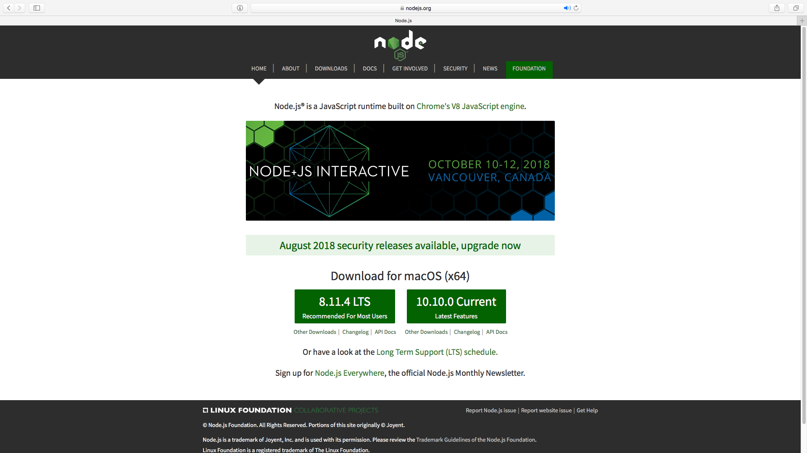

# Setup

## What we'll cover here

Considering you already have a computer, here's a list of what we'll cover:

* NodeJs
* git
* bash

## NodeJS

This is what we need for developing ReactJS web-app projects, and more. 

First, go to [this page](https://nodejs.org/), 



See the two green rectangle buttons? Select one and click download.


Windows: either it'll detect the OS, or navigate to the downloads tab and download the .msi file



If you don't know which version to install, click the LTS version. \(LTS stands for Long Term Support\) Don't worry, you'll be able to switch between versions freely once you get the whole thing going.


After everything's installed, open a terminal and type in

```text
$ node -v
```

If it shows something like

```text
v10.10.0
```

then you're all set.


Windows: Terminal is equivalent to cmd.exe on Windows. Search cmd on the start menu and run as administrator.


### NPM

By the way, Node Package Manager is also something you need when setting up a project \(and more\). BUt it's installed with NodeJS so you don't have to worry about that.

To check, type in 

```text
$ npm -v
```


Windows: again, use cmd.


### NVM

Remember I said above that we can switch between NodeJS versions freely? Well, we need Node Version Manager to do it. 

But I'm too lazy to write a tutorial so I'm just going to put [a link](http://bubkoo.com/2017/01/08/quick-tip-multiple-versions-node-nvm/) to one.

## Git

Git is a version control tool, and since this is a setup tutorial I'll not cover what a version control tool is.The official instruction is [here](https://git-scm.com/book/en/v2/Getting-Started-Installing-Git), but if you're too lazy \(like me\), I'll just put all the necessary commands here:

### Linux

Either

```text
$ sudo apt install git-all
```

or

```text
$ sudo dnf install git-all
```

### Mac

Try checking the git version by

```text
$ git --version
```

If it shows something like

```text
git version 2.16.2
```

then you're already good to go, or else it'll just prompt you to install it. Neat.

### Windows

So grab [this file](https://git-scm.com/download/win) from git's official page and run it. In theory it should work.

